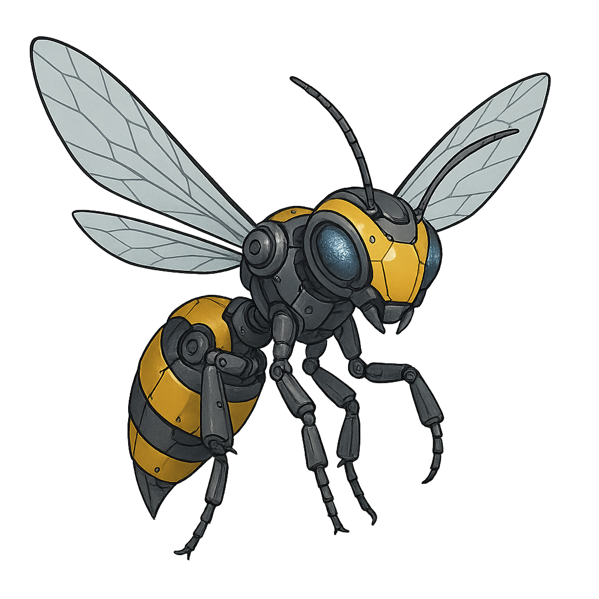
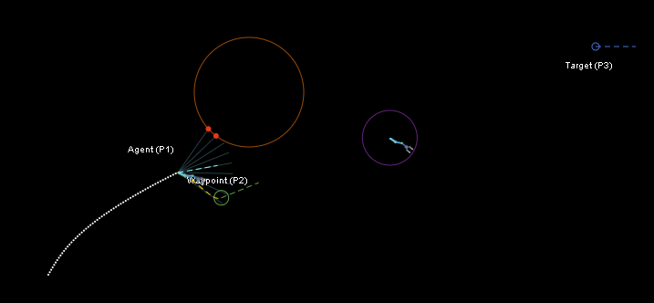
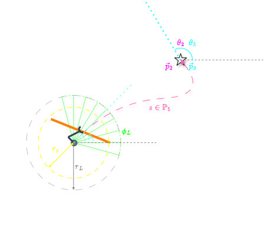
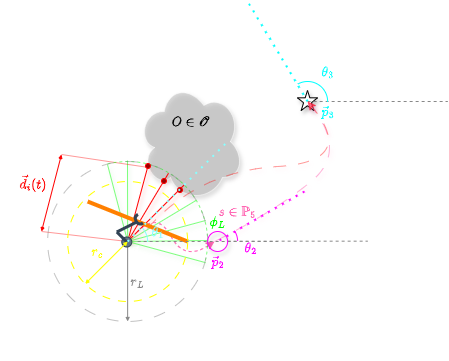
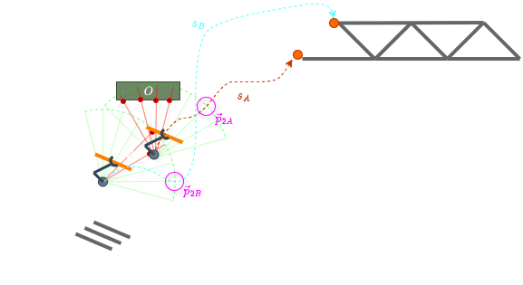

  

# wasp-js

**Waypoint Adaptive Spline Planner Demo (HTML+JS)**

A self-contained HTML+JS demo of the **Waypoint Adaptive Spline Planner (WASP)** algorithm developed by Christian Lozoya. 
WASP is a lightweight and minimal local planner using geometric adaptation of a single waypoint for smooth and dynamically feasible paths.
The demo shows a single agent moving from a start pose to a target while adapting a mid-way waypoint to avoid obstacles detected by simple LiDAR rays. No build system is required.

---

## Quick start
Open `index.html` in a browser. The page loads the following dependencies via CDN:
- `math.js` for small linear algebra utilities used by the quintic fit.

---

## What the demo contains
- **P1 (Agent)**: start position and heading. Moves along the current spline.
- **P2 (Waypoint)**: automatically placed helper point. Teleports to guide the agent away from obstacles based on sensor data.
- **P3 (Target)**: fixed goal position and heading.
- **Obstacles**: static or dynamic objects that the agent can sense.
- **LiDAR fan**: casts rays within its field of view and range. Used to detect obstacles.

---

## How it works

### Quintic spline between current P1 and P2
The planner fits a **quintic polynomial** segment with boundary conditions on position and velocity at the endpoints:
- Start at the agent’s true pose `(P1, θ1)` with velocity vector `v1` aligned to `θ1`.
- End at the waypoint `(P2)` with velocity vector `v2` aligned to the local direction toward the target or P3’s tangent.
- Coefficients are solved once per update by a small 6×6 linear system per axis using `math.lusolve`.
- The path is sampled to create an **arc-length lookup table** for time-uniform motion.

Files and functions:
- `fit_quintic(Pa, va, Pb, vb)`
- `evaluate_quintic_2d(poly, t)`
- `compute_arc_length_table(spline, segments)`
- `get_t_for_arclength(table, s)`
- `quintic_tangent(poly, t)`

### Motion along the spline
- The agent advances a scalar **arc length** `s` at speed `agentSpeed`.
- Parameter `t` is recovered from the arc-length table and the agent pose is updated.
- Heading is set to the spline’s instantaneous tangent.
- When P2 teleports, the agent begins the new spline at t=0 from its live position.

### LiDAR-based avoidance trigger
- Each frame, the agent casts lidar rays across ±(LIDAR_FOV/2)° about the current heading.
- If a ray intersects the circle obstacle or the moving blob within range, the hit is recorded.

Functions:
- `get_lidar_hits(agent, theta)`
- `ray_intersect(x0, y0, theta, cx, cy, r, maxRange)`

### Choosing which side to pass
- The demo counts whether LiDAR hits lie to the **left** or **right** of the forward direction.
- P2 is displaced forward a fixed distance and offset to the side with fewer hits.

Function:
- `compute_avoid_p2(p1, p3, lidarHits)`  
  Produces `P2 = P1 + fwd*P2_AVOID_DIST + side*left*P2_SIDE_DIST`.

### Rebuilding the local plan
- When avoidance triggers, P2 jumps to the avoid position and the quintic is **rebuilt** from the agent’s current pose to P2.
- When rays are clear for a short duration (`AVOIDANCE_RESET_DELAY`), P2 snaps back to P3 and a new quintic is rebuilt.

Function:
- `update_spline_from_p1_to_p2()`  
  Recomputes tangents and coefficients, refreshes the arc-length table, and resets the agent’s local arc-length on the new segment.

### Rendering
- Canvas draws the obstacle, LiDAR rays, spline, and small trail of agent positions.
- Two SVG clones are synchronized with the canvas to depict the agent and the moving blob.

For each animation frame:
1. Cast LiDAR rays
2. If hits: update P2 and rebuild spline
3. Follow spline at constant speed
4. Render scene

Functions:
- `draw()` and `draw_tangent(...)`
- `create_agent_svg_clone(...)` and `sync_svg(...)`

---

## Figures

**Unobstructed case**  

With no LiDAR hits, P2 coincides with P3 and the agent follows a smooth quintic toward the target heading at P3.

**Obstructed case**  

LiDAR detects impending collision, P2 is shifted to the side with fewer hits, and a new quintic is built. The agent follows the detour until the clear timer expires.

**Multi-agent illustration**  

Conceptual scene demonstrating distinct paths for multiple agents. The demo’s code animates a single agent; this figure is illustrative for discussion.

---

## Parameters and defaults

- NUM_LIDAR = 9, LIDAR_FOV = π/2, LIDAR_RANGE = 60
- P2_AVOID_DIST = 40, P2_SIDE_DIST = -40 (negative selects “right” when right has fewer hits)
- AVOIDANCE_RESET_DELAY = 500 ms
- agentSpeed = 30 px/s
- tangentScaleFrac = 0.5 for velocity magnitudes at endpoints

These are chosen for clarity of visualization and stable animation timing on a canvas of 800×420.

---

## Limitations of this demo

- Collision model is circle vs ray only. No polygon meshes or SDF.

<!--
---

## Citation

If you use WASP-JS in academic work, please cite the Zenodo DOI.
@software{wasp_js,
  author    = {Christian Lozoya},
  title     = {WASP-JS: Waypoint Adaptive Spline Planner},
  year      = {2025},
  doi       = {xx.xxxx/zenodo.xxxxx},
  url       = {https://github.com/<USER>/wasp-js}
}
-->

---

## Support This Work

Open source engineering takes a lot of time and coffee. If you would like to directly support ongoing research, development, and maintenance of these tools, you can do so here:

Your support helps keep the project healthy and moving forward.

---

## License

This project is licensed under the GNU Affero General Public License v3.0 (AGPL-3.0). Any modified version made available to users over a network must also be released under the AGPL-3.0. See the LICENSE file for full details.

---

